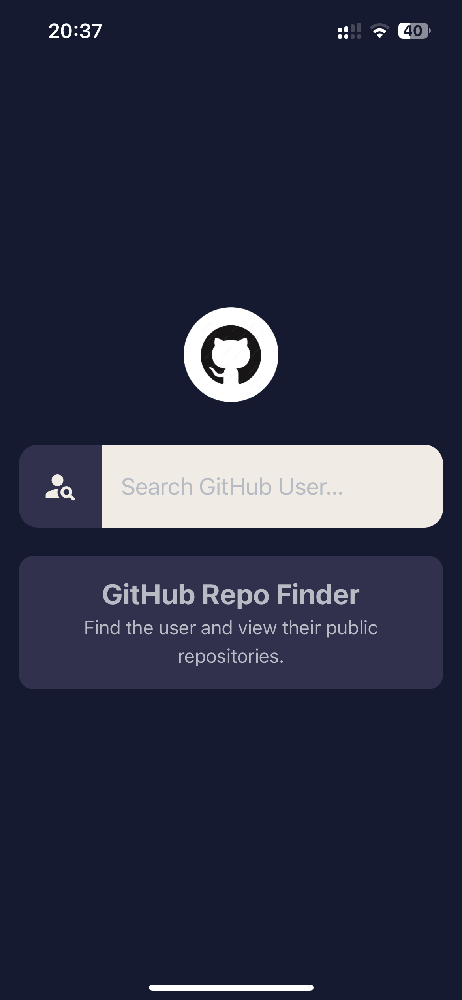
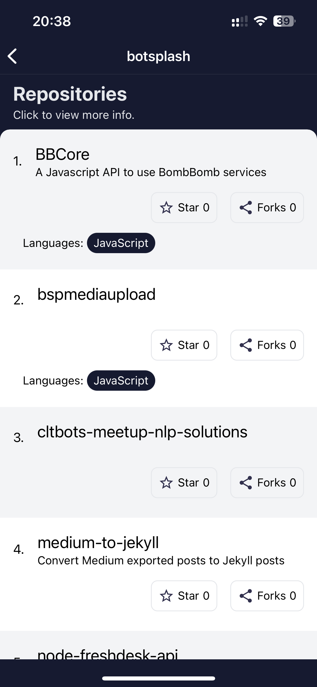

# RepoFinder

Use this app to search GitHub user and view their public repository.

>**Note**: You do not need any form of API keys to run this app.

## Development Environment Used

- Node v20.10.0
- openjdk v17.0.9 (Zulu17)

## The App Icon


## App Previews






## Starting the Application in Debug Mode

Let Metro Bundler run in its _own_ terminal. Open a _new_ terminal from the _root_ of your React Native project. Run the following command to start your _Android_ or _iOS_ app:

### For Android

```bash
# using npm
npm run android

# OR using Yarn
yarn android
```

### For iOS

```bash
# using npm
npm run ios

# OR using Yarn
yarn ios
```

If everything is set up _correctly_, you should see **RepoFinder** running in your _Android Emulator_ or _iOS Simulator_ shortly provided you have set up your emulator/simulator correctly.

This is one way to run your app — you can also run it directly from within Android Studio and Xcode respectively.

